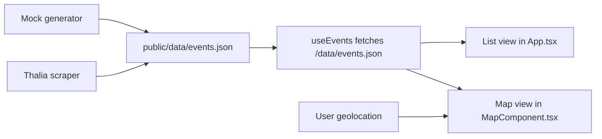

# Lesungen Deutschland

Lesungen Deutschland is a Germany-wide discovery app for author readings and book events. It is a React + TypeScript + Vite frontend that renders a static dataset as a searchable list and Leaflet-based map, with the dataset refreshed from generated mock events plus scraped Thalia event data.

## Product overview

The app helps readers discover upcoming literary events across Germany without needing a backend service. The current implementation is optimized for a static deployment model:

- event data is delivered as `public/data/events.json`
- the frontend loads that file at runtime through `useEvents`
- users can browse events as cards or on a map
- users can search by author, venue/city, or address
- users can center the map near their current location

## Current feature set

- **List view:** event cards with author, title, price, date, venue, and external detail link
- **Map view:** Leaflet markers for each event across Germany
- **Free-text search:** matches `author`, `location.name`, and `location.address`
- **Near me action:** uses browser geolocation to center the map on the user
- **Static data delivery:** no API server; the app fetches `/data/events.json`
- **Automated data refresh:** GitHub Actions can rerun the scraper and commit updated data
- **Automated deployment:** pushes to `main` trigger the GitHub Pages build pipeline

## Architecture overview

### Frontend

- `src/App.tsx` owns the main UI state for search, list/map toggle, and geolocation
- `src/hooks/useEvents.ts` fetches `/data/events.json` and exposes loading/error state
- `src/components/MapComponent.tsx` renders Leaflet markers and popups
- `src/components/Header.tsx` renders the top navigation shell
- `src/types/index.ts` defines the `ReadingEvent` contract used by the frontend

### Data pipeline

- `scripts/generate-mock-data.js` produces 50 mock reading events in the frontend data shape
- `scripts/sources/registry.json` lists every source (bookshops, libraries) with its `eventsUrl` and a `crawlerType`
- `scripts/crawlers/` holds reusable crawlers selected per source: `generic` (JSON-LD/microdata/HTML), `bibliothek-cms` (German library CMS pages), `bibliothek-spa` (Puppeteer-rendered library calendars), `wordpress-events`, `thalia`, `hugendubel`
- `scripts/lesung-filter.js` keeps only author readings (Lesungen) for library sources, dropping workshops, Führungen, Flohmärkte, etc.
- `scripts/scrape.js` runs every enabled source through its crawler, applies the Lesung filter to library sources, normalizes, deduplicates, geocodes, and writes `public/data/events.json`

### Delivery

- `.github/workflows/update-data.yml` runs the scraper daily and can commit updated event data
- `.github/workflows/deploy.yml` builds the Vite app and deploys it to GitHub Pages on pushes to `main`

## Data flow



The intended dataset is a mix of generated mock events and scraped Thalia events. In practice, the committed snapshot depends on the latest scraper run and may temporarily skew toward mock data if the scraper yields no events.

## Repository layout

```text
.
|-- .github/
|   |-- workflows/
|   `-- skills/
|-- public/
|   `-- data/events.json
|-- scripts/
|   |-- generate-mock-data.js
|   |-- scrape.js
|   `-- sources/thalia.js
|-- src/
|   |-- components/
|   |-- hooks/
|   `-- types/
|-- AGENTS.md
`-- docs/specification.md
```

## Local setup

### Prerequisites

- Node.js 20+ recommended
- npm

### Install

```bash
npm ci --legacy-peer-deps
```

`--legacy-peer-deps` matches the current GitHub Actions setup.

### Run locally

```bash
npm run dev
```

Open the Vite URL shown in the terminal.

## Available commands

| Command | Purpose |
| --- | --- |
| `npm run dev` | Start the Vite development server |
| `npm run build` | Type-check and create a production build |
| `npm run lint` | Run ESLint across the repository |
| `npm run preview` | Preview the production build locally |
| `node scripts/generate-mock-data.js` | Regenerate a mock-only `public/data/events.json` |
| `node scripts/scrape.js` | Rebuild `public/data/events.json` from mock data plus scraper output |

## Deployment and update workflows

### GitHub Pages deployment

`deploy.yml` runs on pushes to `main` and:

1. installs dependencies with `npm ci --legacy-peer-deps`
2. runs `npm run build`
3. uploads `dist/`
4. deploys the artifact to GitHub Pages

### Daily data refresh

`update-data.yml` runs on a daily cron and on manual dispatch. It:

1. installs dependencies
2. runs `node scripts/scrape.js`
3. stages `public/data/events.json`
4. commits and pushes when the dataset changed

## Known limitations

- Thalia coordinates are currently approximate and generated with random jitter rather than geocoded venue positions.
- The Thalia scraper is selector-sensitive and may return zero events when the source markup changes.
- The header navigation links are placeholders (`href="#"`) rather than routed navigation.
- The frontend consumes one static JSON file, so there is no incremental loading, faceted search, or live backend filtering.
- The event dataset intentionally mixes synthetic mock data with scraped data, which is useful for UI coverage but not yet editorially curated.
- There is no automated test suite beyond the existing lint/build checks.

## Suggested next improvements

1. Replace approximate coordinates with real geocoding or source-specific venue coordinates.
2. Split data ingestion by source and add source-level health checks or diagnostics.
3. Convert placeholder header links into actual routed sections or remove them.
4. Add filters for date, price, and distance using the existing `EventFilter` direction in `useEvents`.
5. Introduce automated tests for data-shape handling and core list/map/search behavior.
