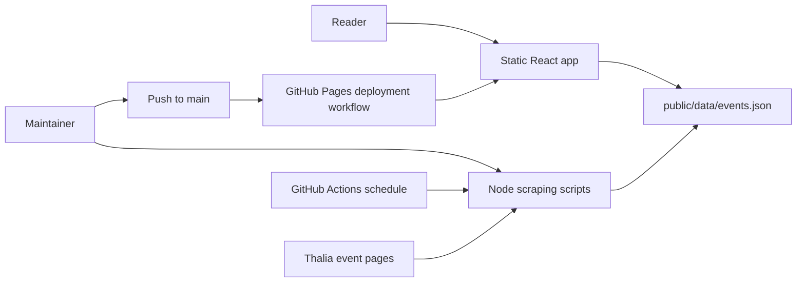
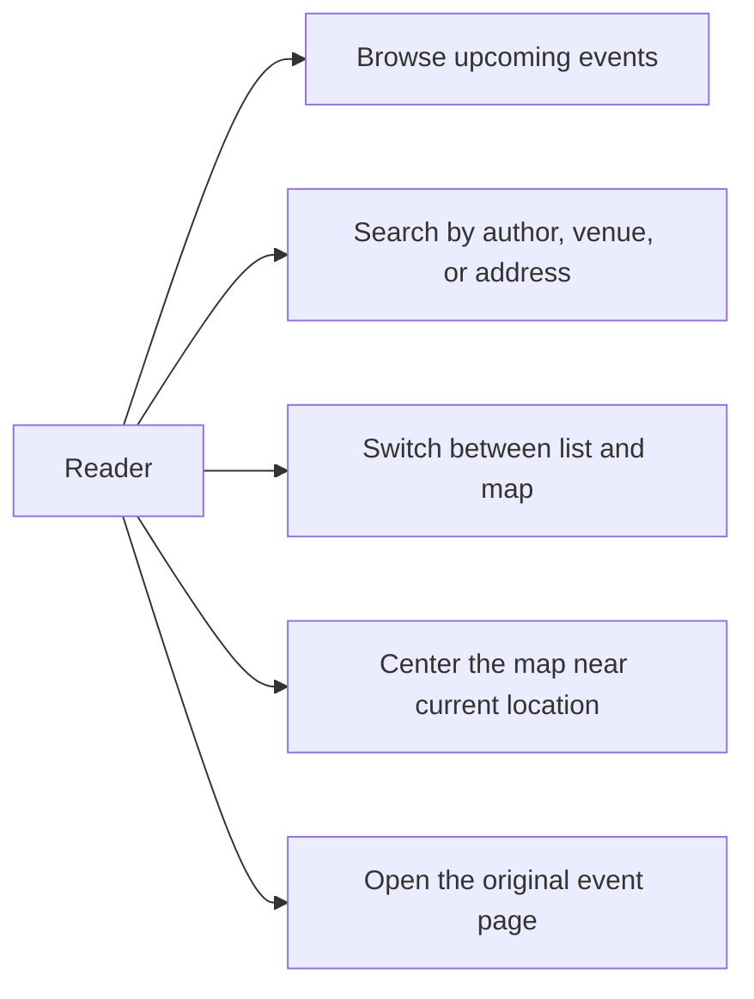
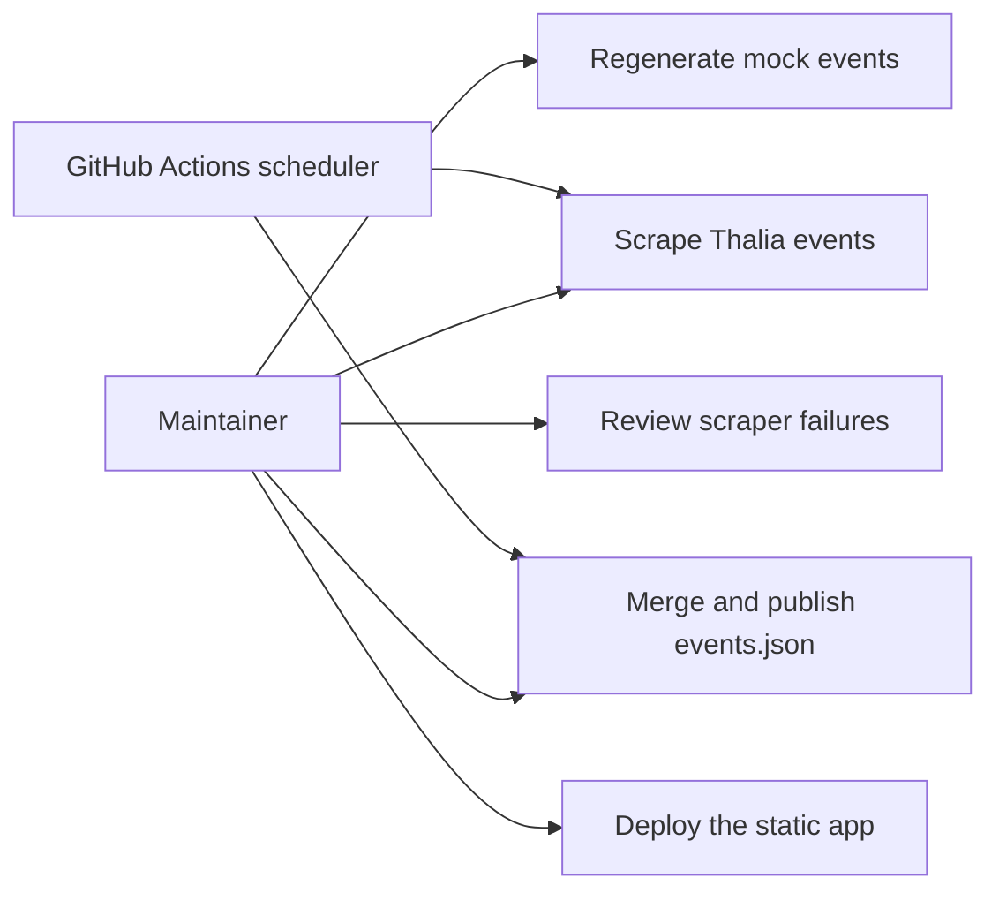

# Product specification: Lesungen Deutschland

## Vision

Lesungen Deutschland should become a simple, trustworthy way to discover author readings and book events across Germany from a single lightweight web app.

## Problem statement

Readers currently have to search across scattered bookseller pages, venue sites, and event listings to find literary events. This project reduces that fragmentation by aggregating events into one searchable, map-enabled experience that can be deployed as a static site.

## Goals

- Help readers find upcoming literary events across Germany quickly.
- Make the discovery experience usable on both list and map views.
- Keep operations lightweight through a static frontend and file-based dataset.
- Refresh event data without manual editing by using scripts and GitHub Actions.
- Leave room for additional sources, richer filters, and better location quality.

## Non-goals

- Full ticketing or checkout flows
- User accounts, saved searches, or personalization
- Editorial CMS or manual moderation tooling
- Real-time inventory, availability, or booking integration
- A backend API in the current phase

## Personas and actors

| Actor | Description | Current interaction |
| --- | --- | --- |
| Reader | End user searching for readings and book events | Uses list, map, search, and external links |
| Maintainer | Developer or operator maintaining data and deployment | Runs scripts, updates code, reviews GitHub Actions |
| Source site | External event publisher such as Thalia | Provides source HTML for scraping |
| GitHub Actions scheduler | Automation actor for daily refreshes | Triggers `update-data.yml` |
| GitHub Pages | Static hosting target | Serves the built Vite app |

## Current system context

The current system is a single-page React application built with Vite and TypeScript. It reads event data from `public/data/events.json`, which is generated by Node scripts. One workflow refreshes data on a schedule; another builds and deploys the frontend to GitHub Pages.

## Use-case diagram: reader experience

## Use-case diagram: maintainer and pipeline operations

## Functional requirements

### Current user-facing requirements

1. The app must load a static event dataset from `/data/events.json`.
2. The app must show loading and error states while data is being fetched.
3. The app must present events in a list view with key metadata.
4. The app must present events in a map view with markers and popups.
5. The app must allow free-text search across author, venue name, and address.
6. The app must allow the user to request geolocation-based centering of the map.
7. The app must let the user open an external detail URL when available.

### Current operational requirements

1. Maintainers must be able to regenerate mock data locally.
2. Maintainers must be able to rebuild the merged dataset locally.
3. The repository must support scheduled data refresh through GitHub Actions.
4. The repository must support GitHub Pages deployment on pushes to `main`.

## Non-functional requirements

- **Static-first delivery:** the site should remain usable without a backend runtime.
- **Buildability:** the project should continue to pass `npm run lint` and `npm run build`.
- **Type safety:** frontend event consumers should remain aligned with the TypeScript data contract.
- **Recoverability:** partial scraper failures should not corrupt the repository structure or frontend build.
- **Maintainability:** source-specific logic should stay in `scripts/sources/` rather than leaking into UI components.
- **Performance:** the app should remain lightweight enough for static hosting and client-side filtering.

## Data model summary

| Field | Type | Notes |
| --- | --- | --- |
| `id` | string | Unique identifier per event record |
| `title` | string | Event title or title-like source text |
| `author` | string | Currently explicit for mock data; inferred from title for Thalia |
| `date` | ISO string | Parsed and rendered client-side |
| `location.name` | string | Venue or location label |
| `location.address` | string | Address or source location string |
| `location.lat` | number | Required by the map |
| `location.lng` | number | Required by the map |
| `price.amount` | number | `0` is shown as free |
| `price.currency` | string | Currently `EUR` |
| `description` | string? | Optional descriptive copy |
| `url` | string? | Optional external destination |
| `source` | string | Data lineage marker such as `Mock Generator` or `Thalia` |

## Current workflows

### Reader workflow

1. Open the static site.
2. The app fetches `/data/events.json`.
3. The user searches, switches between list and map, or requests "near me".
4. The user opens an event detail page through an external link.

### Data refresh workflow

1. A maintainer or scheduled workflow runs `node scripts/scrape.js`.
2. The script regenerates mock events.
3. The script scrapes Thalia events with Puppeteer.
4. The script merges results and writes `public/data/events.json`.
5. The GitHub Actions workflow commits the updated file when it changed.

### Deployment workflow

1. A change is pushed to `main`.
2. GitHub Actions installs dependencies and runs `npm run build`.
3. The built `dist/` artifact is deployed to GitHub Pages.

## Risks and constraints

- The Thalia scraper is brittle because it depends on external markup.
- Scraped coordinates are currently approximate and not venue-accurate.
- The dataset is intentionally mixed between mock and scraped events, which is good for UI coverage but weak for production trust.
- Header navigation links are placeholders, so information architecture is not yet backed by routing.
- There is no automated test suite beyond lint/build, increasing regression risk for data-shape and UI behavior changes.

## Success metrics

- Users can find relevant events with search or map browsing in a single session.
- The site continues to build and deploy without manual fixes.
- Scheduled refreshes keep `public/data/events.json` current.
- Scraped events make up an increasing share of the dataset over time.
- Map interactions remain stable for the full dataset size.

## Roadmap

### Near term

1. Improve Thalia parsing quality and stabilize selectors.
2. Replace approximate coordinates with real geocoding or venue coordinates.
3. Add basic filters for date, price, and distance.
4. Replace placeholder header links with actual sections or routes.

### Mid term

1. Add additional event sources beyond Thalia.
2. Introduce source diagnostics and scraper health visibility.
3. Add automated tests for `useEvents`, filtering, and map/list rendering.
4. Improve dataset quality controls before committing updates.

### Longer term

1. Consider editorial curation or moderation tooling.
2. Evaluate whether a backend or indexed dataset is needed for more advanced discovery features.
3. Support richer user journeys such as saved searches or event subscriptions if the product scope expands.
